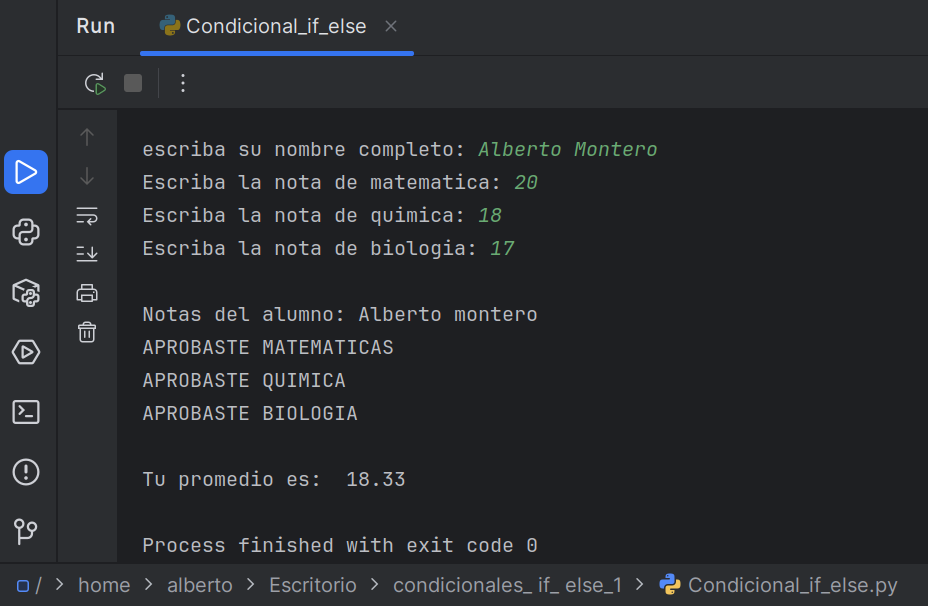

# Explorando las Condicionales if-else en Python
Descripción del Proyecto
Este repositorio contiene un sencillo Condicional_if_else diseñado para demostrar el uso fundamental de las estructuras condicionales if-else. El programa permite al usuario ingresar el nombre de un estudiante y sus calificaciones en varias asignaturas, para luego calcular su promedio y determinar, mediante condicionales, un resultado basado en dicho promedio.

## Características Clave
Entrada de Datos Dinámica: Solicita el nombre del alumno y sus notas (matemáticas, química, biología).

Cálculo de Promedio: Calcula el promedio de las notas ingresadas.

Lógica Condicional if-else: Utiliza sentencias if-else para procesar el promedio (por ejemplo, para determinar si aprueba o no, aunque no se muestre explícitamente en el output, se infiere del uso de condicionales).

Demostración Clara: Ideal para principiantes que buscan entender cómo funcionan las condicionales básicas en Python.

